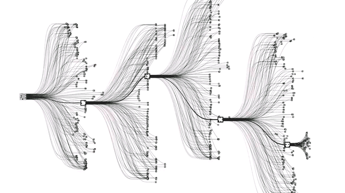

# bbl-go

## Ecosystème / histoire

Ce n'est pas un jeu où l'on cherche à tuer l'adversaire, mais juste à se partager le goban et en avoir un peu mieux

breve histoire
[famous go games](https://senseis.xmp.net/?FamousGoGames) 
* [atomic bomb game](https://senseis.xmp.net/?AtomicBombGame)

softpower en Asie

## Unique

### combinatoire unique
10⁴⁷ -> échec

10⁸⁰  -> atomes dans l'univers connu

10¹⁷⁰  -> nombre de jeu possible au go

### le graal de l'IA
AlphaGo

### écrat de niveau unique en son genre
Si l'on créé des groupes de niveaux pour tous les joueurs du monde selon ces deux règles:
* Un membre du groupe N gagne à 80% contre un joueur du groupe N-1
* Un membre du groupe N gagne à 20% contre un joueur du groupe N+1
32 échelles de niveaux

Statistiques sur le nombre de joueurs ? Et Classement ? Comment gagner avec 9 pierres de handicap ?

stratégie appliquée à l'entreprise:
ref: https://fas.org/man/eprint/lai.pdf

trouver qq proverbes parlant: l'apprentissage du Go est complexe et la transmission du savoir se passe par proverbe:
* Le coin est en or, le bord en argent, le centre est un jardin public
* Le point vital de mon ennemi est mon point vital 
* Si vous attaquez votre adversaire, surveillez vos arrières

## Règle 

[règles du jeu](http://jeudego.org/_php/regleGo.php)

point vital

3 methodes de capture : shicho, geta, double atari

handicap

"live coding"
* [easy capture](https://tsumego-hero.com/sets/view/117)
* [easy life](https://tsumego-hero.com/sets/view/104)
* [easy kill](https://tsumego-hero.com/sets/view/105)

ref globales:
* [wiki fr](https://fr.wikipedia.org/wiki/Go_(jeu))
* [online goban editor](http://goban.co/)
