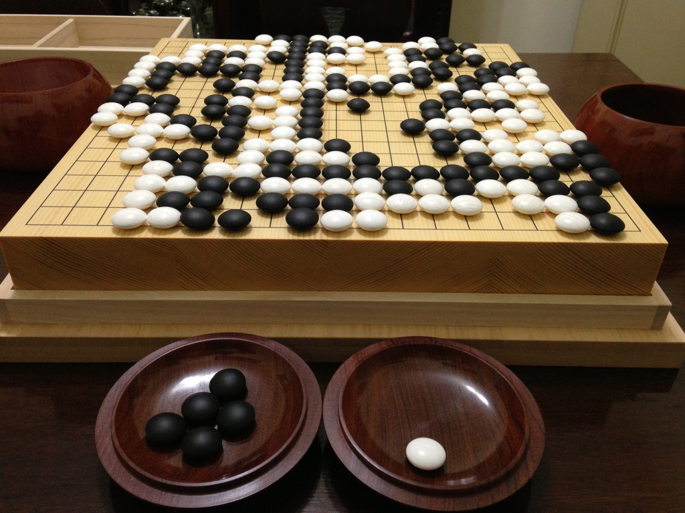

# bbl-go

## Histoire

Ce n'est pas un jeu où l'on cherche à tuer l'adversaire, mais juste à se partager le goban et en avoir un peu mieux

### Un jeu millénaire

Le jeu de Go a probablement été créé en Chine pendant la période des Printemps et Automnes (771-453 av. J.-C.). Plus tard, Confucius (551-479 av. J.-C.) mentionne le go dans ses Entretiens.

Début du 3eme siècle, le go est alors ajouté aux trois « arts sacrés » (peinture, musique et calligraphie) pratiqués par l'empereur et ses courtisans, pour devenir l'un des « quatre arts du lettré ». Il conserve ce statut jusqu'à la fin du 19eme siècle.

### Arrivée du jeu au Japon

La pratique du go se généralisera parmi les samouraïs comme entraînement à la stratégie militaire. À Kyoto, les moines nichirens (secte bouddhiste japonaise) seront les fondateurs de la maison Hon'inbō, la première grande école de go, qui demeurera ouverte jusqu'en 1940.

### Âge d'or du go

Cela commence dès la seconde moitié du 16eme siècle. Avec l'unification du Japon par Tokugawa Ieyasu en 1603, le go, soutenu par les militaires et le shogunat Tokugawa, entre dans sa période classique et connaît un développement ininterrompu, qui dure plus de deux siècles et demi. Grâce à la protection du shogun, le go acquiert un statut officiel et devient une institution gouvernementale.

L'installation de ce système professionnel et la lutte pour les meilleurs titres conduit à une élévation considérable du niveau du jeu japonais, certains joueurs célèbres révolutionnant à eux seuls la théorie du jeu. Ce fut en particulier le cas des deux plus grands joueurs de cette période, Hon'inbō Dōsaku et Hon'inbō Shūsaku, qui furent tous deux nommés Kisei (« saint du go »).

### Seconde Guerre mondiale

Le go continua son chemin malgré toutes les difficultés inhérentes à la Seconde Guerre mondiale. Une anecdote illustre bien la rage de jouer des professionnels du go.

Au printemps 1945, Iwamoto Kaoru devint challenger d'Hashimoto Utaro dans le prestigieux tournoi d’Honinbō. Jouer à Tokyo étant impensable après les terribles bombardements de mars 1945, il fut décidé que le match se déroulerait durant l'été à Hiroshima. Les adversaires tombèrent d'accord pour disputer la seconde partie du 4 au 6 août à Itsukaichi, dans la banlieue d'Hiroshima.

Au troisième jour du match, les joueurs faisaient une pause dans le jardin, lorsqu'ils aperçurent une explosion fulgurante suivie par la formation d'un gigantesque « champignon » et par un coup de vent violent qui brisa les fenêtres et renversa les meubles et la table de jeu. Comme ils en étaient au yose (fin de partie après les combats), ils replacèrent la position et terminèrent la partie, qui se finit par une victoire de Hashimoto avec cinq points d'avance. Ce ne fut que plus tard dans la journée, en voyant arriver les rescapés de la première bombe atomique, que les joueurs comprirent la tragédie à laquelle ils avaient miraculeusement échappé.

La confrontation se termina par un résultat nul (3-3) en novembre 1945, durant l'occupation américaine, après la reddition du Japon.

### Go moderne

Après la Seconde Guerre mondiale, le go se développe sous l'impulsion de la fédération japonaise (Nihon Ki-in). En Chine, où il végétait depuis des siècles, le go, après avoir surmonté la crise de la Révolution culturelle, connaît un renouveau spectaculaire depuis les années 1980 et un développement sans précédent. Dans les années 1990, c'est au tour de la Corée d'entrer en scène avec de très forts joueurs, comme Lee Chang-ho, considéré alors comme le meilleur joueur du monde. À travers le go, les trois pays de l'Asie de l'Est ont trouvé une nouvelle occasion – pacifique – de vider leurs querelles historiques.

En Europe, au milieu des années 2010, le plus fort joueur professionnel est Fan Hui, Chinois arrivé en France en 2000 et naturalisé français en 2013. Aujourd'hui, on compte plus de quarante millions de joueurs, dont un million d'Européens.

[famous go games](https://senseis.xmp.net/?FamousGoGames) 
* [atomic bomb game](https://senseis.xmp.net/?AtomicBombGame)

softpower en Asie

## Le go, un jeu unique en son genre

### Une combinatoire unique
10⁴⁷ -> échec

10⁸⁰  -> atomes dans l'univers connu

10¹⁷⁰  -> nombre de jeu possible au go

### Le graal de l'IA

Au delà de la combinatoire, le go est le jeu qui a le plus longtemps résisté à l'IA car l'évaluation du plateau de jeu est très complexe et peut changer à chaque coup.
Avant l'arrivé d'AlphaGo, la meilleure IA ne pouvait battre un bon amateur. Très rapidement AlphaGo a lui balayé le champion du monde.
Il faut dire qu'il est difficile pour un humain d'assimiler des millions de parties comme AlphaGo l'a fait

### Ecart de niveau unique en son genre
Si l'on créé des groupes de niveaux pour tous les joueurs du monde selon ces deux règles:
* Un membre du groupe N gagne à 80% contre un joueur du groupe N-1
* Un membre du groupe N gagne à 20% contre un joueur du groupe N+1

le jeu de dame aurait 8 groupes

le jeu d'échec aurait 16 groupes

le jeu de go aurait 32 groupes

### Statistiques

En France en 2013: 113 clubs et 1416 licenciés. On estime à 11000 le nombre de joueurs ayant eu une licence à la Fédération Française de Go depuis sa création.

On évalue à 60 millions de joueur dont 20 millions en Chine

### 2 échelles de niveau

* Une échelle amateur basé sur une système ELO:

30 kyu (30k) --> 29 kyu (29k) ... 2 kyu (2k) --> 1 kyu (1k) --> 1 dan (1d) --> 2 dan (2d) ... 8 dan (8d) --> 9 dan (9d)

* Une échelle à part entière pour les professionelles basée sur le mérite

1 dan pro (1p) --> 2 dan pro (2p) ..... 9 dan pro (9p)

### Application du Go au monde de l'entreprise et la diplomatie 

l'art de la guerre de Sun Tzu

stratégie appliquée à l'entreprise:
ref: https://fas.org/man/eprint/lai.pdf

### proverbes

L'apprentissage du Go est complexe et la transmission du savoir se passe par proverbe:
* Le coin est en or, le bord en argent, le centre est un jardin public
* Le point vital de mon ennemi est mon point vital 
* Si vous attaquez votre adversaire, surveillez vos arrières

## Règle 

[règles du jeu](http://jeudego.org/_php/regleGo.php)

### 3 methodes de capture : shicho, geta, double atari

* geta:
[goban](http://goban.co/boards/425)
* shicho:
[goban](http://goban.co/boards/426)
* double atari
[goban](http://goban.co/boards/427)

### Handicap
Le jeu de go permet d'équilibrer une partie entre deux joueurs de niveau très différents sans dénaturé le jeu en donnant des pierres d'avance au joueur le plus faible, l'écart peut aller jusqu'à 9 pierres d'avance

### "live coding"
* [easy capture](https://tsumego-hero.com/sets/view/117)
* [easy life](https://tsumego-hero.com/sets/view/104)
* [easy kill](https://tsumego-hero.com/sets/view/105)

ref globales:
* [wiki fr](https://fr.wikipedia.org/wiki/Go_(jeu))
* [online goban editor](http://goban.co/)
